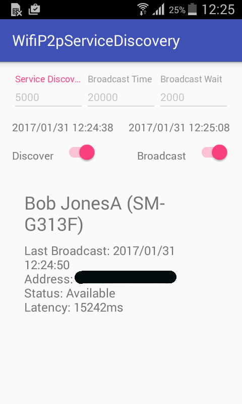
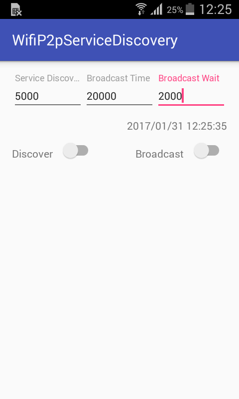

# WiFi P2P Service Discovery Tester

This app is designed to test run WiFi P2P service discovery on Android. Getting service discovery to work reliably on Android is a tricky business. This app is built on the approach outlined on this [helpful Stack Overflow article](http://stackoverflow.com/questions/26300889/wifi-p2p-service-discovery-works-intermittently). The user can set the following time intervals for testing purposes:

* Service discovery: The time (in ms) in between service discovery runs (suggestion approx 5000ms)
* Broadcast time: The time (in ms) in between calls to discoverPeers that is as per the Stack Exchange post required to ensure the service being published is noticed by new peers (suggestion approx 20000ms)
* Broadcast wait: The time (in ms) from when the service is first added as a local service until the first time discoverPeers is called. Afterwards discoverPeers will be called as per the broadcast time interval.

*Usage* Set the values you want: Flip the switch to start discovery on at least one device. Then flip the switch on Broadcast on another device. The app will show the time taken to discover the device. The system clocks on all devices used must be in sync for this to be accurate.

*Likely results*: Devices take between 4 and 20 seconds to be discovered. 

Official Android documentation on WiFi P2P:
[Android documentation](https://developer.android.com/training/connect-devices-wirelessly/nsd-wifi-direct.html)

## Screenshots

